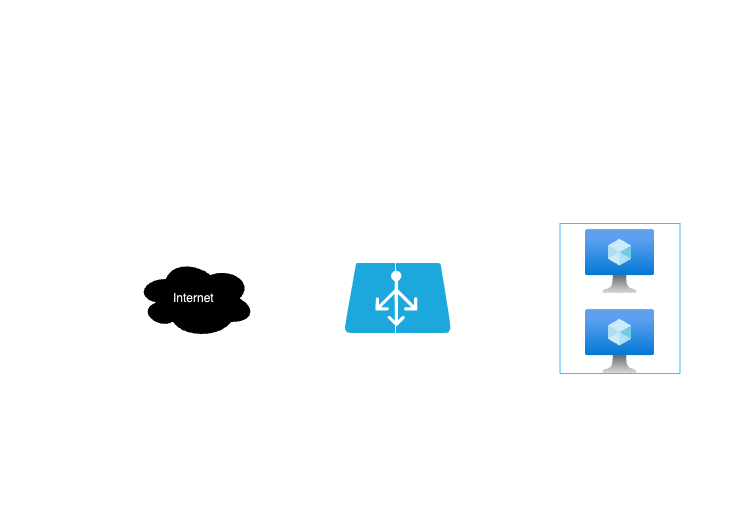

# Auto-healing Web Tier (Azure + Terraform)

## Choice
**Azure + Terraform** was chosen to keep costs low (Basic Load Balancer + small VM size) and meet **IaC only** and **self-healing** requirements.

## What this creates (plan-only)
- Resource Group, VNet/Subnet, NSG (HTTP/80 + SSH/22)
- Public IP + **Azure Load Balancer** (HTTP probe + rule)
- VM Scale Set (Ubuntu 22.04, 2 instances, NGINX via cloud-init)
- **Auto-healing** via VMSS health probe + automatic instance repair

## Architecture


## How to run (plan only)
```bash
terraform fmt -recursive
terraform init
terraform validate
terraform plan -out plan.tfplan
terraform show -no-color plan.tfplan > plan.txt
# Auto-healing Web Tier (Azure + Terraform)

## Choice
**Azure + Terraform** to keep costs low (Basic Load Balancer + small VM size) and meet “IaC only” and “self-healing” requirements.

## What this creates (plan-only)
- Resource Group, VNet/Subnet, NSG (HTTP/80 + SSH/22)
- Public IP + **Azure Load Balancer** (HTTP probe + rule)
- **VM Scale Set** (Ubuntu 22.04, 2 instances, NGINX via cloud-init)
- **Auto-heal** via VMSS health probe + automatic instance repair

## How to run (plan only)
```bash
terraform fmt -recursive
terraform init
terraform validate
terraform plan -out plan.tfplan
terraform show -no-color plan.tfplan > plan.txt

